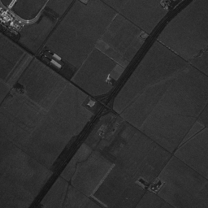
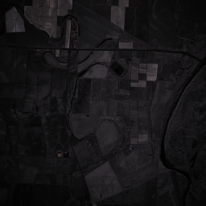
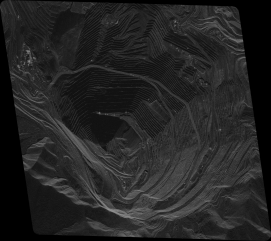

# nitv
NITF Visualizer (`nitv`) is a program which will read a NITF file and attempt to create a `png` from the image data

For questions, feature requests, or bugs, please open an issue.

Currently assumes that any NITF with multiple image segments is a single image, split along rows (each segment contains all columns).

## Usage
First, install from source or directly using `cargo`...
```sh
cargo install nitv
```
... then provide a NITF file(s)
```sh
nitv <path-to-nitf>(s)
```
There are a handful of options available
```
--output          Output folder [default: .]
--size            sqrt(num-pixels) e.g., --size 50 -> 50^2 pixel image [default: 256]
--level           Log level [default: info] [possible values: off, error, warn, info, debug, trace]
--nitf-log        Enable logging for nitf reading
```

## Current support (files from [Umbra's Open Data](https://umbra.space/open-data/))
### SIDD / monochrome

### RGB/RGB + LUT

### SICD
If the file has SICD metadata, it is used to compute the ground resolution similar to [sarpy's `get_ground_resolution()`](https://github.com/ngageoint/sarpy/blob/master/sarpy/io/complex/sicd_elements/SICD.py#L507-L523).

